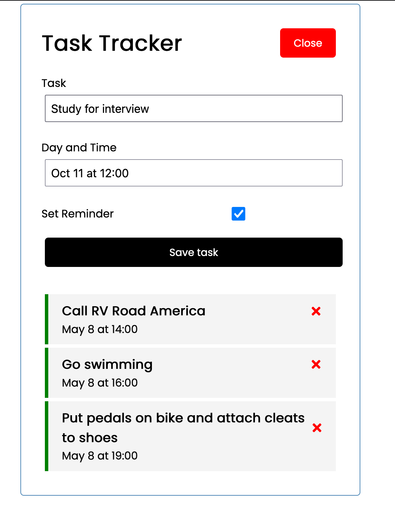

# task-tracker
Project that demos MERN (mongodb, Express REST API, React Frontend, Nodejs server) full stack application



The frontend react application sits behind an Nginx server that first decrypts HTTPS traffic. Both are packaged into a docker container and deployed as a kubernetes service.

The backend nodejs express API server may sit in the same k8s service - in which case, will communicate through localhost - or in a different service, in which case communication will happen through service names.

The frontend react app is currently being built and deployed in Kubernetes [here](https://github.com/davidfox87/terraform-eks-acm-alb-istio/tree/main/applications/task-tracker-app) using Kustomize manifests. ArgoCD watches that directory for any changes to the configuration setup, such as deployment replicas or image tags, and then automatically deploys to our cluster.


# Build and push frontend to dockerhub or AWS ECR
```
cd frontend
./build-and-push.sh
```
ghfghjk;kl;jkl
dhdfh
hello again and againbkfggfjhcjgjffgbchdfhfg;hj;hjk;hjkkkkkkkkl;kl;jk;hl;kl;kl;